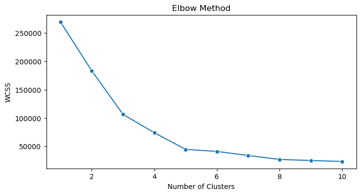
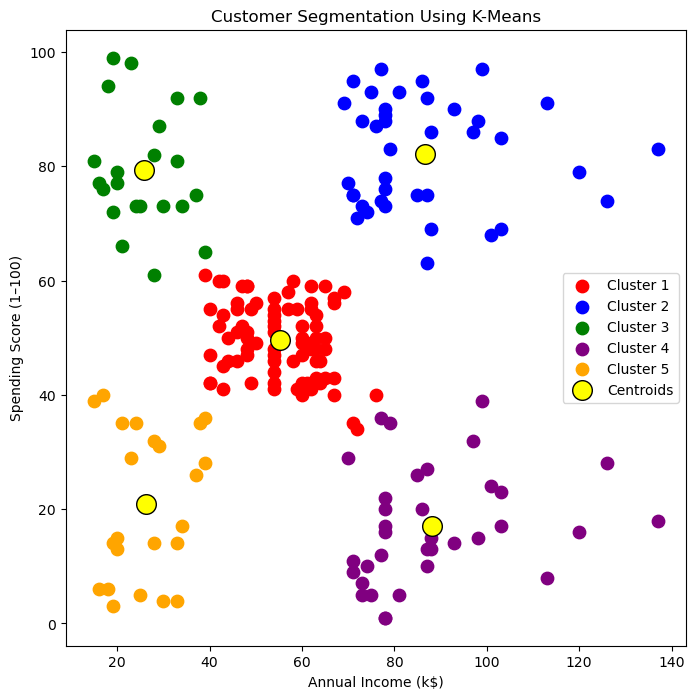

# Customer Segmentation Using K-Means  
### Machine Learning · Unsupervised Learning · Marketing Analytics

This project performs **customer segmentation** using the Mall Customer dataset.  
By applying the **K-Means clustering algorithm**, we identify distinct customer groups based on:

- **Annual Income**
- **Spending Score**

Such segmentation helps businesses create **targeted marketing**, **personalized offers**, and **pricing strategies** that maximize revenue.

---

## 🚀 Objectives
- Explore customer behavior using EDA  
- Apply **Elbow Method** to find the optimal number of clusters  
- Build a **K-Means clustering model**  
- Visualize clusters & centroids  
- Interpret segments to extract business value  

---

## 🛠 Tech Stack
- Python  
- Pandas, NumPy  
- Scikit-learn  
- Matplotlib, Seaborn  

---

## 📂 Project Workflow

### **1. Exploratory Data Analysis**
- Missing value check  
- Statistical summary  
- Distributions of income & spending  
- Scatterplots  
- Correlation heatmap  

### **2. Feature Selection**
The model uses:
- **Annual Income (k$)**
- **Spending Score (1–100)**

### **3. Elbow Method**
We test k = 1 to 10 and choose **k = 5**.

### **4. K-Means Clustering**
Model:
```python
KMeans(n_clusters=5, init="k-means++", random_state=42)
```

### **5. Visualization**

#### Elbow Method



#### Customer Clusters

---

## 🧠 Insights from Clusters

| Cluster | Income | Spending | Interpretation |
|--------|--------|----------|----------------|
| 1 | Low | Low | Low-value segment |
| 2 | High | High | VIP / Premium |
| 3 | Low | High | Impulsive buyers |
| 4 | High | Low | Potential high-value customers |
| 5 | Medium | Medium | Stable customer base |

---

## 💼 Business Value
- Improve **targeted marketing**
- Optimize **pricing & promotions**
- Emphasize **customer retention**
- Improve overall **ROI**

---

## 📁 Notebook  
All steps (EDA → Model → Insights) are implemented in:  
`notebooks/customer_segmentation_kmeans.ipynb`


